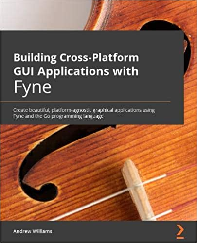

As well as the release of [version 2.0.0](/blog/2021/01/25/introducing-fyne-v2.0.html#about)
this week brings exciting news that the first book dedicated to Fyne has been published! Pre-orders will be on their way to purchasers already and anyone who missed the chance to buy in advance can now get a copy [from the publisher](https://www.packtpub.com/product/building-cross-platform-gui-applications-with-fyne/9781800563162).

This book covers most aspects of building a Fyne app, including the [new APIs](http://developer.fyne.io/api/v2.0/)
introduced in the recent release. It will step you through getting started with Fyne and
how to build an app using the toolkit all the way through to uploading your software to 
market places and App Stores.

With 5 fully-working example apps and many other code illustrations this book is an essential companion to the existing documentation and videos created by the Fyne community.

Many thanks to all of the team both at [Fyne](/) and [Packt](https://www.packtpub.com/) who helped make this book happen, and also to everyone who buys a copy!

We leave you with the book's dedication:

> To the fantastic Fyne community, everyone involved in the project, or who uses it in their own work. Without your contributions and involvement, there would be no toolkit to write about.
– Andrew Williams
